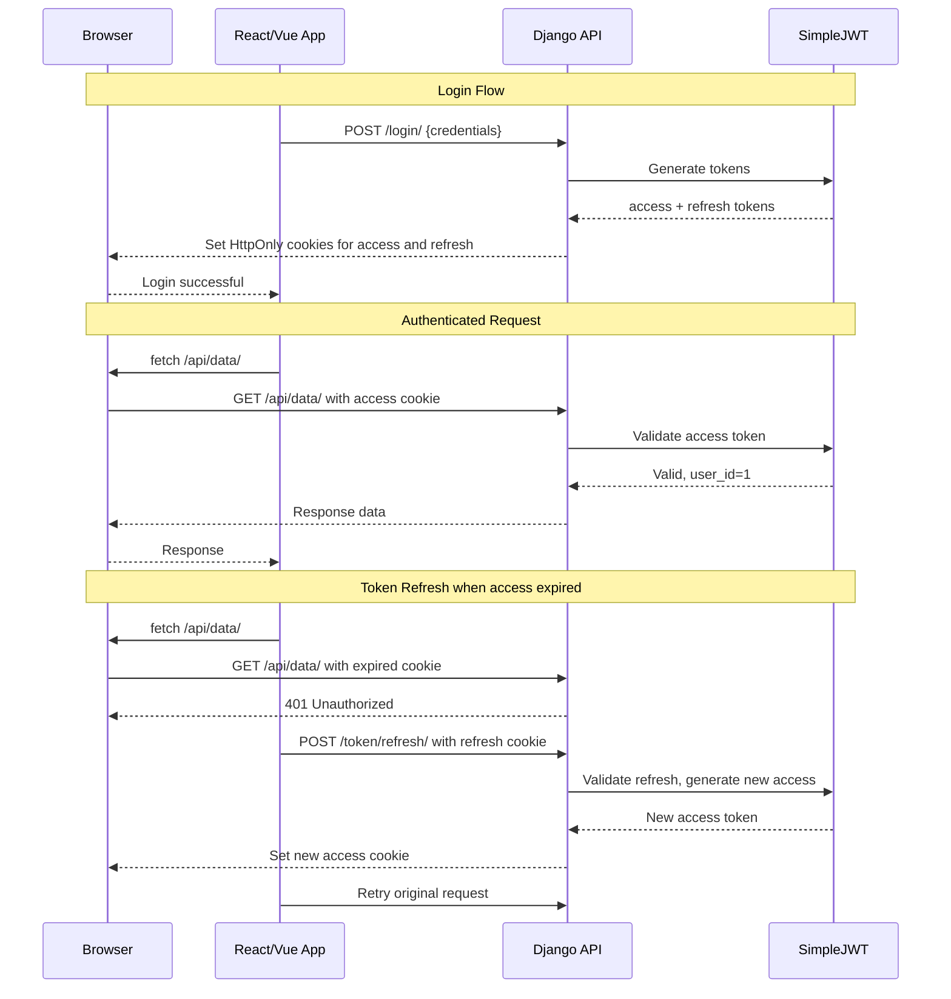

# JWT & Cookie Authentication

This guide covers JWT authentication with HTTP-only cookies—the recommended approach for Single Page Applications (SPAs).

## Why JWT Cookies?

Traditional approaches to SPA authentication have security tradeoffs:

| Approach | Vulnerability | Issue |
|----------|--------------|-------|
| Token in localStorage | XSS | JavaScript can read and steal tokens |
| Token in sessionStorage | XSS | Same as localStorage |
| Token in memory | UX | Lost on page refresh |
| Session cookies | CSRF | Requires CSRF protection |

**JWT in HTTP-only cookies** provides the best of both worlds:

- **XSS protection**: JavaScript cannot access HTTP-only cookies
- **Automatic handling**: Browser sends cookies with every request
- **Refresh tokens**: Secure token rotation
- **CSRF protection**: Available via SameSite attribute

---

## Setup

### 1. Install Dependencies

```bash
pip install dj-rest-auth djangorestframework-simplejwt
```

### 2. Configure Django Settings

```python title="settings.py"
from datetime import timedelta

INSTALLED_APPS = [
    # ...
    'rest_framework',
    'rest_framework_simplejwt',
    'rest_framework_simplejwt.token_blacklist',  # For logout
    'dj_rest_auth',
]

REST_FRAMEWORK = {
    'DEFAULT_AUTHENTICATION_CLASSES': [
        'dj_rest_auth.jwt_auth.JWTCookieAuthentication',
    ],
}

REST_AUTH = {
    'USE_JWT': True,
    'JWT_AUTH_COOKIE': 'access',
    'JWT_AUTH_REFRESH_COOKIE': 'refresh',
    'JWT_AUTH_HTTPONLY': True,
    'JWT_AUTH_SECURE': False,  # True in production!
    'JWT_AUTH_SAMESITE': 'Lax',
    'JWT_AUTH_RETURN_EXPIRATION': True,
}

SIMPLE_JWT = {
    'ACCESS_TOKEN_LIFETIME': timedelta(minutes=15),
    'REFRESH_TOKEN_LIFETIME': timedelta(days=7),
    'ROTATE_REFRESH_TOKENS': True,
    'BLACKLIST_AFTER_ROTATION': True,
    'UPDATE_LAST_LOGIN': True,
}
```

### 3. Run Migrations

```bash
python manage.py migrate
```

---

## How It Works



---

## Frontend Integration

### React/Axios Example

```typescript title="api.ts"
import axios from 'axios';

const api = axios.create({
  baseURL: 'http://localhost:8000/api',
  withCredentials: true,  // Required for cookies
});

// Response interceptor for token refresh
api.interceptors.response.use(
  (response) => response,
  async (error) => {
    const originalRequest = error.config;
    
    if (error.response?.status === 401 && !originalRequest._retry) {
      originalRequest._retry = true;
      
      try {
        // Attempt to refresh token
        await api.post('/auth/token/refresh/');
        // Retry original request
        return api(originalRequest);
      } catch (refreshError) {
        // Refresh failed, redirect to login
        window.location.href = '/login';
        return Promise.reject(refreshError);
      }
    }
    
    return Promise.reject(error);
  }
);

export default api;
```

```typescript title="auth.ts"
import api from './api';

export async function login(username: string, password: string) {
  const response = await api.post('/auth/login/', { username, password });
  return response.data;
}

export async function logout() {
  await api.post('/auth/logout/');
}

export async function getCurrentUser() {
  const response = await api.get('/auth/user/');
  return response.data;
}
```

### Vue/Fetch Example

```typescript title="composables/useAuth.ts"
import { ref } from 'vue';

const API_URL = 'http://localhost:8000/api';

export function useAuth() {
  const user = ref(null);
  const loading = ref(false);
  const error = ref(null);

  async function login(username: string, password: string) {
    loading.value = true;
    error.value = null;
    
    try {
      const response = await fetch(`${API_URL}/auth/login/`, {
        method: 'POST',
        credentials: 'include',  // Required for cookies
        headers: { 'Content-Type': 'application/json' },
        body: JSON.stringify({ username, password }),
      });
      
      if (!response.ok) throw new Error('Login failed');
      
      const data = await response.json();
      user.value = data.user;
      return data;
    } catch (e) {
      error.value = e.message;
      throw e;
    } finally {
      loading.value = false;
    }
  }

  async function logout() {
    await fetch(`${API_URL}/auth/logout/`, {
      method: 'POST',
      credentials: 'include',
    });
    user.value = null;
  }

  async function fetchUser() {
    try {
      const response = await fetch(`${API_URL}/auth/user/`, {
        credentials: 'include',
      });
      if (response.ok) {
        user.value = await response.json();
      }
    } catch {
      user.value = null;
    }
  }

  return { user, loading, error, login, logout, fetchUser };
}
```

---

## Cookie Configuration Deep Dive

### JWT_AUTH_HTTPONLY

```python
REST_AUTH = {
    'JWT_AUTH_HTTPONLY': True,  # Recommended
}
```

When `True`:
- Cookies cannot be accessed via JavaScript (`document.cookie`)
- Protects against XSS attacks
- Refresh token is NOT included in JSON response (only in cookie)

When `False`:
- Tokens are accessible via JavaScript
- Tokens are included in JSON response body
- **Use only if you need to access tokens programmatically**

---

### JWT_AUTH_SECURE

```python
REST_AUTH = {
    'JWT_AUTH_SECURE': True,  # Always True in production!
}
```

When `True`:
- Cookies are only sent over HTTPS
- Prevents token theft via network sniffing

!!! danger "Production Requirement"
    Always set `JWT_AUTH_SECURE = True` in production. The only reason to set it to `False` is for local development without HTTPS.

---

### JWT_AUTH_SAMESITE

Controls when cookies are sent with cross-origin requests.

```python
REST_AUTH = {
    'JWT_AUTH_SAMESITE': 'Lax',  # Default, recommended
}
```

| Value | Behavior | Use Case |
|-------|----------|----------|
| `'Strict'` | Only same-site requests | Maximum security, may break some flows |
| `'Lax'` | Same-site + top-level navigations | Good balance of security and usability |
| `'None'` | All requests (requires `Secure`) | Cross-origin APIs (with CORS) |

---

### JWT_AUTH_COOKIE_DOMAIN

Share cookies across subdomains:

```python
REST_AUTH = {
    'JWT_AUTH_COOKIE_DOMAIN': '.example.com',
}
```

This allows:
- `api.example.com` to set cookies
- `app.example.com` to read cookies
- `www.example.com` to read cookies

---

## Token Refresh Strategies

### Strategy 1: Interceptor-based (Recommended)

Automatically refresh tokens when requests fail:

```typescript
api.interceptors.response.use(
  (response) => response,
  async (error) => {
    if (error.response?.status === 401 && !error.config._retry) {
      error.config._retry = true;
      await api.post('/auth/token/refresh/');
      return api(error.config);
    }
    return Promise.reject(error);
  }
);
```

### Strategy 2: Proactive Refresh

Refresh before token expires using the expiration time:

```typescript
let accessExpiration: Date | null = null;

async function login(username: string, password: string) {
  const response = await api.post('/auth/login/', { username, password });
  accessExpiration = new Date(response.data.access_expiration);
  scheduleRefresh();
  return response.data;
}

function scheduleRefresh() {
  if (!accessExpiration) return;
  
  // Refresh 1 minute before expiration
  const refreshTime = accessExpiration.getTime() - Date.now() - 60000;
  
  setTimeout(async () => {
    try {
      const response = await api.post('/auth/token/refresh/');
      accessExpiration = new Date(response.data.access_expiration);
      scheduleRefresh();
    } catch {
      // Refresh failed, redirect to login
      window.location.href = '/login';
    }
  }, Math.max(0, refreshTime));
}
```

---

## CORS Configuration

For SPAs on different domains, configure CORS:

```bash
pip install django-cors-headers
```

```python title="settings.py"
INSTALLED_APPS = [
    # ...
    'corsheaders',
]

MIDDLEWARE = [
    'corsheaders.middleware.CorsMiddleware',  # Must be high in the list
    'django.middleware.common.CommonMiddleware',
    # ...
]

# Development
CORS_ALLOWED_ORIGINS = [
    'http://localhost:3000',
    'http://127.0.0.1:3000',
]

# Production
CORS_ALLOWED_ORIGINS = [
    'https://app.example.com',
]

CORS_ALLOW_CREDENTIALS = True  # Required for cookies
```

---

## Token Blacklisting

Enable token blacklisting to invalidate tokens on logout:

### 1. Add to Installed Apps

```python title="settings.py"
INSTALLED_APPS = [
    # ...
    'rest_framework_simplejwt.token_blacklist',
]
```

### 2. Run Migrations

```bash
python manage.py migrate
```

### 3. Configure SimpleJWT

```python title="settings.py"
SIMPLE_JWT = {
    'ROTATE_REFRESH_TOKENS': True,
    'BLACKLIST_AFTER_ROTATION': True,
}
```

Now when users logout, their refresh token is blacklisted and cannot be reused.

---

## Security Checklist

- [ ] `JWT_AUTH_HTTPONLY = True` - Prevent XSS
- [ ] `JWT_AUTH_SECURE = True` - HTTPS only (production)
- [ ] `JWT_AUTH_SAMESITE = 'Lax'` or `'Strict'` - CSRF protection
- [ ] Token blacklist enabled - Proper logout
- [ ] Short access token lifetime (5-15 minutes)
- [ ] CORS configured correctly
- [ ] Rate limiting enabled

```python title="Production settings.py"
REST_AUTH = {
    'USE_JWT': True,
    'JWT_AUTH_COOKIE': 'access',
    'JWT_AUTH_REFRESH_COOKIE': 'refresh',
    'JWT_AUTH_HTTPONLY': True,
    'JWT_AUTH_SECURE': True,
    'JWT_AUTH_SAMESITE': 'Lax',
}

SIMPLE_JWT = {
    'ACCESS_TOKEN_LIFETIME': timedelta(minutes=5),
    'REFRESH_TOKEN_LIFETIME': timedelta(days=1),
    'ROTATE_REFRESH_TOKENS': True,
    'BLACKLIST_AFTER_ROTATION': True,
}
```

---

## Troubleshooting

### Cookies Not Being Set

1. Check `withCredentials: true` (Axios) or `credentials: 'include'` (Fetch)
2. Verify CORS allows credentials: `CORS_ALLOW_CREDENTIALS = True`
3. Check browser developer tools → Application → Cookies

### Cookies Not Being Sent

1. Verify `SameSite` attribute allows cross-origin
2. Check if `Secure` flag matches your protocol (HTTPS)
3. Confirm cookie domain matches request domain

### 401 on Every Request

1. Verify `JWTCookieAuthentication` is in `DEFAULT_AUTHENTICATION_CLASSES`
2. Check if token has expired
3. Verify cookie name matches `JWT_AUTH_COOKIE` setting
