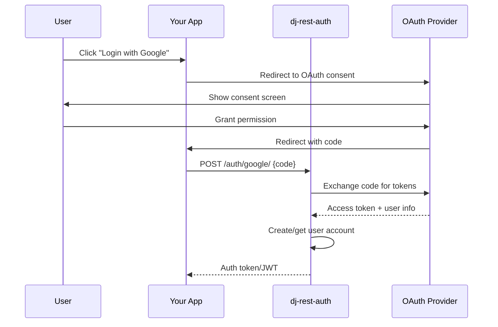

# Social Authentication

Integrate OAuth providers like Google, GitHub, and Facebook using django-allauth.

!!! note "Maintainer's Note"
    dj-rest-auth has optional and narrow support for django-allauth social authentication. The focus is on providing a clean API wrapper for the most common use cases.

## Overview



---

## Setup

### 1. Install Dependencies

```bash
pip install 'dj-rest-auth[with-social]'
```

This installs django-allauth.

### 2. Configure Django Settings

```python title="settings.py"
INSTALLED_APPS = [
    # Django
    'django.contrib.sites',
    # ...
    
    # REST Framework
    'rest_framework',
    'rest_framework.authtoken',
    
    # Allauth
    'allauth',
    'allauth.account',
    'allauth.socialaccount',
    'allauth.socialaccount.providers.google',   # Add providers you need
    'allauth.socialaccount.providers.github',
    'allauth.socialaccount.providers.facebook',
    
    # dj-rest-auth
    'dj_rest_auth',
    'dj_rest_auth.registration',
]

MIDDLEWARE = [
    # ...
    'allauth.account.middleware.AccountMiddleware',
]

SITE_ID = 1

AUTHENTICATION_BACKENDS = [
    'django.contrib.auth.backends.ModelBackend',
    'allauth.account.auth_backends.AuthenticationBackend',
]
```

### 3. Run Migrations

```bash
python manage.py migrate
```

---

## Google OAuth

### 1. Create Google OAuth Credentials

1. Go to [Google Cloud Console](https://console.cloud.google.com/)
2. Create a new project or select existing
3. Navigate to **APIs & Services** → **Credentials**
4. Click **Create Credentials** → **OAuth 2.0 Client IDs**
5. Configure consent screen if prompted
6. Select **Web application**
7. Add authorized redirect URIs:
   - Development: `http://localhost:3000/auth/google/callback`
   - Production: `https://yourapp.com/auth/google/callback`
8. Save your **Client ID** and **Client Secret**

### 2. Add Social Application in Django Admin

1. Go to `/admin/`
2. Navigate to **Social Applications**
3. Click **Add**
4. Fill in:
   - **Provider**: Google
   - **Name**: Google
   - **Client ID**: Your client ID
   - **Secret key**: Your client secret
   - **Sites**: Select your site

### 3. Create the View

```python title="views.py"
from allauth.socialaccount.providers.google.views import GoogleOAuth2Adapter
from allauth.socialaccount.providers.oauth2.client import OAuth2Client
from dj_rest_auth.registration.views import SocialLoginView

class GoogleLogin(SocialLoginView):
    adapter_class = GoogleOAuth2Adapter
    callback_url = 'http://localhost:3000/auth/google/callback'
    client_class = OAuth2Client
```

### 4. Add URL

```python title="urls.py"
from django.urls import path
from .views import GoogleLogin

urlpatterns = [
    # ...
    path('api/auth/google/', GoogleLogin.as_view(), name='google_login'),
]
```

### 5. Frontend Flow

=== "Authorization Code Flow (Recommended)"

    ```typescript title="GoogleAuth.tsx"
    const GOOGLE_CLIENT_ID = 'your-client-id';
    const REDIRECT_URI = 'http://localhost:3000/auth/google/callback';

    function GoogleLoginButton() {
      const handleLogin = () => {
        const authUrl = new URL('https://accounts.google.com/o/oauth2/v2/auth');
        authUrl.searchParams.set('client_id', GOOGLE_CLIENT_ID);
        authUrl.searchParams.set('redirect_uri', REDIRECT_URI);
        authUrl.searchParams.set('response_type', 'code');
        authUrl.searchParams.set('scope', 'openid email profile');
        authUrl.searchParams.set('access_type', 'offline');
        authUrl.searchParams.set('prompt', 'consent');
        
        window.location.href = authUrl.toString();
      };

      return <button onClick={handleLogin}>Login with Google</button>;
    }

    // Callback page component
    async function handleGoogleCallback() {
      const params = new URLSearchParams(window.location.search);
      const code = params.get('code');
      
      const response = await fetch('/api/auth/google/', {
        method: 'POST',
        credentials: 'include',
        headers: { 'Content-Type': 'application/json' },
        body: JSON.stringify({ code }),
      });
      
      const data = await response.json();
      // Handle successful login
    }
    ```

=== "Using Google Sign-In Library"

    ```html
    <script src="https://accounts.google.com/gsi/client" async></script>
    ```

    ```typescript
    function GoogleLoginButton() {
      useEffect(() => {
        google.accounts.id.initialize({
          client_id: 'your-client-id',
          callback: handleCredentialResponse,
        });
        google.accounts.id.renderButton(
          document.getElementById('google-button'),
          { theme: 'outline', size: 'large' }
        );
      }, []);

      async function handleCredentialResponse(response: any) {
        // response.credential is the ID token
        const res = await fetch('/api/auth/google/', {
          method: 'POST',
          credentials: 'include',
          headers: { 'Content-Type': 'application/json' },
          body: JSON.stringify({ id_token: response.credential }),
        });
        // Handle response
      }

      return <div id="google-button"></div>;
    }
    ```

---

## GitHub OAuth

### 1. Create GitHub OAuth App

1. Go to [GitHub Developer Settings](https://github.com/settings/developers)
2. Click **New OAuth App**
3. Fill in:
   - **Application name**: Your app name
   - **Homepage URL**: `http://localhost:3000`
   - **Authorization callback URL**: `http://localhost:3000/auth/github/callback`
4. Save **Client ID** and **Client Secret**

### 2. Add Social Application

Add via Django Admin (similar to Google setup).

### 3. Create the View

```python title="views.py"
from allauth.socialaccount.providers.github.views import GitHubOAuth2Adapter
from allauth.socialaccount.providers.oauth2.client import OAuth2Client
from dj_rest_auth.registration.views import SocialLoginView

class GitHubLogin(SocialLoginView):
    adapter_class = GitHubOAuth2Adapter
    callback_url = 'http://localhost:3000/auth/github/callback'
    client_class = OAuth2Client
```

### 4. Add URL

```python title="urls.py"
from .views import GitHubLogin

urlpatterns = [
    # ...
    path('api/auth/github/', GitHubLogin.as_view(), name='github_login'),
]
```

### 5. Frontend Flow

```typescript
const GITHUB_CLIENT_ID = 'your-client-id';
const REDIRECT_URI = 'http://localhost:3000/auth/github/callback';

function GitHubLoginButton() {
  const handleLogin = () => {
    const authUrl = new URL('https://github.com/login/oauth/authorize');
    authUrl.searchParams.set('client_id', GITHUB_CLIENT_ID);
    authUrl.searchParams.set('redirect_uri', REDIRECT_URI);
    authUrl.searchParams.set('scope', 'read:user user:email');
    
    window.location.href = authUrl.toString();
  };

  return <button onClick={handleLogin}>Login with GitHub</button>;
}

// Callback handler
async function handleGitHubCallback() {
  const code = new URLSearchParams(window.location.search).get('code');
  
  const response = await fetch('/api/auth/github/', {
    method: 'POST',
    credentials: 'include',
    headers: { 'Content-Type': 'application/json' },
    body: JSON.stringify({ code }),
  });
  
  const data = await response.json();
  // Handle successful login
}
```

---

## Facebook OAuth

### 1. Create Facebook App

1. Go to [Facebook Developers](https://developers.facebook.com/)
2. Create a new app
3. Add **Facebook Login** product
4. Configure **Valid OAuth Redirect URIs**

### 2. Create the View

```python title="views.py"
from allauth.socialaccount.providers.facebook.views import FacebookOAuth2Adapter
from dj_rest_auth.registration.views import SocialLoginView

class FacebookLogin(SocialLoginView):
    adapter_class = FacebookOAuth2Adapter
```

### 3. Add URL

```python title="urls.py"
from .views import FacebookLogin

urlpatterns = [
    # ...
    path('api/auth/facebook/', FacebookLogin.as_view(), name='facebook_login'),
]
```

---

## Connecting Social Accounts

Allow users to connect additional social accounts to their existing account:

### 1. Create Connect Views

```python title="views.py"
from allauth.socialaccount.providers.google.views import GoogleOAuth2Adapter
from allauth.socialaccount.providers.github.views import GitHubOAuth2Adapter
from allauth.socialaccount.providers.oauth2.client import OAuth2Client
from dj_rest_auth.registration.views import SocialConnectView

class GoogleConnect(SocialConnectView):
    adapter_class = GoogleOAuth2Adapter
    callback_url = 'http://localhost:3000/auth/google/callback'
    client_class = OAuth2Client

class GitHubConnect(SocialConnectView):
    adapter_class = GitHubOAuth2Adapter
    callback_url = 'http://localhost:3000/auth/github/callback'
    client_class = OAuth2Client
```

### 2. Add URLs

```python title="urls.py"
from .views import GoogleConnect, GitHubConnect

urlpatterns = [
    # ...
    path('api/auth/google/connect/', GoogleConnect.as_view(), name='google_connect'),
    path('api/auth/github/connect/', GitHubConnect.as_view(), name='github_connect'),
]
```

!!! note "Authentication Required"
    Connect views require the user to be authenticated. The social account will be linked to the current user.

---

## Managing Social Accounts

### List Connected Accounts

```python title="urls.py"
from dj_rest_auth.registration.views import SocialAccountListView

urlpatterns = [
    # ...
    path('api/auth/social-accounts/', SocialAccountListView.as_view(), name='social_accounts'),
]
```

**Response:**

```json
[
    {
        "id": 1,
        "provider": "google",
        "uid": "123456789",
        "last_login": "2026-02-15T10:30:00Z",
        "date_joined": "2026-01-01T09:00:00Z"
    },
    {
        "id": 2,
        "provider": "github",
        "uid": "987654321",
        "last_login": "2026-02-14T15:45:00Z",
        "date_joined": "2026-02-01T12:00:00Z"
    }
]
```

### Disconnect Social Account

```python title="urls.py"
from dj_rest_auth.registration.views import SocialAccountDisconnectView

urlpatterns = [
    # ...
    path(
        'api/auth/social-accounts/<int:pk>/disconnect/',
        SocialAccountDisconnectView.as_view(),
        name='social_account_disconnect'
    ),
]
```

```bash
curl -X POST http://localhost:8000/api/auth/social-accounts/1/disconnect/ \
  -H "Authorization: Token your-token"
```

---

## JWT with Social Auth

Social authentication works seamlessly with JWT:

```python title="settings.py"
REST_AUTH = {
    'USE_JWT': True,
    'JWT_AUTH_COOKIE': 'access',
    'JWT_AUTH_REFRESH_COOKIE': 'refresh',
}
```

The social login endpoints will return JWT tokens (or set cookies) just like regular login.

---

## Troubleshooting

### "Callback URL Mismatch"

Ensure the callback URL in your view matches exactly:
- The URL registered with the OAuth provider
- The URL your frontend redirects to

### "Access Denied" or "Invalid Grant"

1. Check that you're using the correct flow (code vs token)
2. Verify client ID and secret are correct
3. Ensure the authorization code hasn't expired (use immediately)

### "User Already Exists"

If a user tries to login with a social account that's linked to a different email:

```python title="settings.py"
SOCIALACCOUNT_EMAIL_AUTHENTICATION_AUTO_CONNECT = True
```

Or handle it in your frontend by prompting the user to connect accounts.
