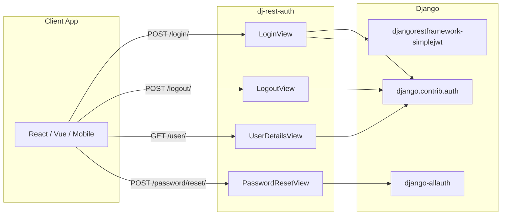

# dj-rest-auth

<p style="font-size: 1.4em; color: var(--md-default-fg-color--light);">
Drop-in authentication endpoints for Django REST Framework. Works seamlessly with SPAs and mobile apps.
</p>

[](https://github.com/iMerica/dj-rest-auth/actions/workflows/main.yml)
[](https://pypi.org/project/dj-rest-auth/)
[](https://pypi.org/project/dj-rest-auth/)
[](https://pypi.org/project/dj-rest-auth/)

---

## Why dj-rest-auth?

Building authentication for your API shouldn't require reinventing the wheel. **dj-rest-auth** provides a complete set of REST API endpoints for user authentication, registration, and account management—all following security best practices.

<div class="grid cards" markdown>

-   :material-lightning-bolt:{ .lg .middle } **Quick Setup**

    ---

    Install with pip and add a few lines to your Django settings. Get authentication working in minutes.

    [:octicons-arrow-right-24: Getting started](getting-started/installation.md)

-   :material-shield-lock:{ .lg .middle } **Secure by Default**

    ---

    HTTP-only JWT cookies, token blacklisting, throttling, and CSRF protection built-in.

    [:octicons-arrow-right-24: Security options](guides/jwt-cookies.md)

-   :material-puzzle:{ .lg .middle } **Fully Customizable**

    ---

    Every serializer is overridable. Extend or replace any component to fit your needs.

    [:octicons-arrow-right-24: Customization](configuration/customization.md)

-   :fontawesome-brands-google:{ .lg .middle } **Social Authentication**

    ---

    Integrate Google, GitHub, Facebook, and other OAuth providers via django-allauth.

    [:octicons-arrow-right-24: Social auth](guides/social-auth.md)

</div>

## Features

| Feature | Description |
|---------|-------------|
| **Login / Logout** | Token and JWT-based authentication with session support |
| **Registration** | User signup with email verification (via django-allauth) |
| **Password Management** | Reset via email, change with old password verification |
| **User Details** | Retrieve and update user profile information |
| **JWT Cookies** | Secure HTTP-only cookie transport for SPAs |
| **Social Auth** | OAuth2 login with Google, GitHub, Facebook, and more |
| **Token Refresh** | Automatic JWT refresh with sliding sessions |

## Requirements

| Package | Version |
|---------|---------|
| Python | >= 3.10 |
| Django | >= 4.2 |
| Django REST Framework | >= 3.14 |

## Quick Example

```python title="settings.py"
INSTALLED_APPS = [
    # ...
    'rest_framework',
    'rest_framework.authtoken',
    'dj_rest_auth',
]

REST_AUTH = {
    'USE_JWT': True,
    'JWT_AUTH_COOKIE': 'auth',
    'JWT_AUTH_HTTPONLY': True,
}
```

```python title="urls.py"
from django.urls import path, include

urlpatterns = [
    path('api/auth/', include('dj_rest_auth.urls')),
]
```

That's it! You now have these endpoints:

- `POST /api/auth/login/` - Obtain token
- `POST /api/auth/logout/` - Revoke token
- `POST /api/auth/password/reset/` - Request password reset
- `POST /api/auth/password/change/` - Change password
- `GET /api/auth/user/` - Get current user

[:octicons-arrow-right-24: See the full quickstart guide](getting-started/quickstart.md)

## Architecture



## License

MIT License - See [LICENSE](https://github.com/iMerica/dj-rest-auth/blob/master/LICENSE) for details.
